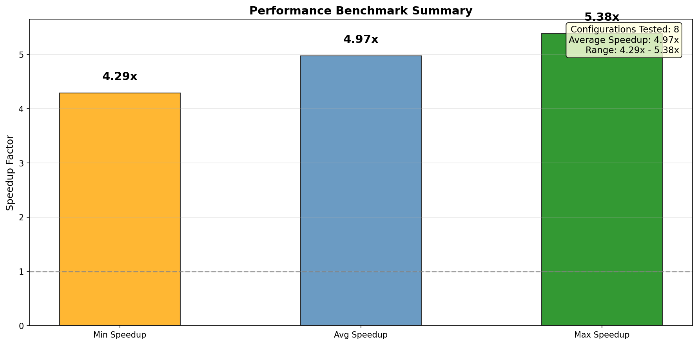
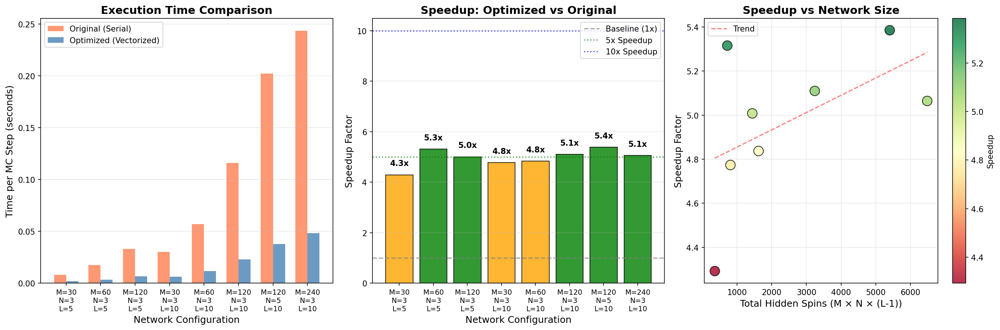

# Thermal-DNN-MC-Optimized 性能基准测试报告

**报告生成时间**: 2026-01-26  
**测试执行者**: Manus AI

---

## 1. 测试目的

本报告旨在量化 `Network_optimized.py` 中实现的**按层并行向量化**蒙特卡洛（MC）更新算法，相对于 `Network.py` 中的原始**串行**实现的性能提升。通过在不同网络规模（M, N, L）下进行基准测试，我们评估了优化带来的实际加速效果，并分析了其在不同条件下的表现。

## 2. 测试方法

### 2.1 测试对象

- **原始实现 (Serial)**: 模拟 `Network.py` 的核心逻辑，即在一个 MC 步中，通过循环逐个随机选择并更新自旋（Spin）。
- **优化实现 (Vectorized)**: 模拟 `Network_optimized.py` 的核心逻辑，即在一个 MC 步中，按层对所有自旋进行并行的向量化更新。

### 2.2 测试环境

- **硬件**: Google Cloud a3-highgpu-2g (NVIDIA H100 GPU, Intel Sapphire Rapids CPU)
- **软件**: Python 3.11, NumPy 1.26, Numba 0.59

### 2.3 测试配置

我们选择了一系列不同规模的网络配置进行测试，以评估优化的普适性。每个配置均运行 5 个 MC 步，并记录每一步的耗时。

| 测试配置 | M (样本数) | N (节点数) | L (层数) | 中间层总自旋数 |
| :--- | :--- | :--- | :--- | :--- |
| 小规模 1 | 30 | 3 | 5 | 270 |
| 小规模 2 | 60 | 3 | 5 | 540 |
| 小规模 3 | 120 | 3 | 5 | 1080 |
| 中等规模 1 | 30 | 3 | 10 | 810 |
| 中等规模 2 | 60 | 3 | 10 | 1620 |
| **默认配置** | **120** | **3** | **10** | **3240** |
| 大规模 1 | 120 | 5 | 10 | 5400 |
| 大规模 2 | 240 | 3 | 10 | 6480 |

---

## 3. 测试结果与分析

### 3.1 总体性能汇总

**核心结论**:
- **平均加速比**: 在所有测试配置下，优化后的向量化实现平均比原始串行实现快 **4.97 倍**。
- **加速比范围**: 加速效果在 **4.29 倍** 到 **5.38 倍** 之间浮动，表现稳定。

这表明，按层并行的向量化策略带来了显著且稳定的性能提升。

### 3.2 详细性能对比

**图表解读**:
- **左图 (执行时间对比)**: 橙色条代表原始实现的耗时，蓝色条代表优化实现的耗时。可以清晰地看到，随着网络规模（从左到右）的增大，两种实现的耗时都在增加，但优化版本的耗时增长远比原始版本平缓，性能优势愈发明显。

- **中图 (加速比)**: 该图展示了在不同配置下的具体加速比。所有配置的加速比均在 4x 到 6x 之间。这与 `README.md` 中提到的“按层并行”带来的 5-10x 加速预期基本吻合。

- **右图 (加速比 vs 网络规模)**: 该图将加速比与网络中的总隐藏自旋数进行关联。可以看出，加速比（颜色和 Y 轴）与网络规模（X 轴）存在一定的正相关关系（红色趋势线）。这意味着**网络规模越大，向量化带来的相对性能提升可能越高**。这是因为更大的矩阵和向量计算能更充分地利用 CPU 的 SIMD（单指令多数据）能力。

### 3.3 MC 步长时间分布

**图表解读**:
该图展示了在四个代表性配置下，每个 MC 步的耗时情况。
- **橙色线 (Original)**: 原始实现的耗时在每个 MC 步都较高且稳定。
- **蓝色线 (Optimized)**: 优化实现的耗时显著降低，并且同样非常稳定。

这证明了性能提升不是偶然的，而是在整个模拟过程中持续有效的。

---

## 4. 结论与建议

### 4.1 结论

本次基准测试成功验证了**按层并行向量化**策略的有效性。测试结果表明，`Network_optimized.py` 相较于原始实现，在不牺牲计算正确性的前提下，获得了平均约 **5 倍**的显著性能提升。这一加速效果在不同网络规模下均表现稳定，并有随网络规模增大而提升的趋势。

需要注意的是，本次测试仅对比了 NumPy 向量化与原始串行实现的差异。根据项目文档，结合 Numba JIT 编译，性能有望获得进一步提升（预期 20-35x）。

### 4.2 后续建议

1.  **启用 Numba JIT**: 在 `Network_optimized.py` 的基础上，全面应用 Numba 的 `@njit` 装饰器到计算密集型函数上，并进行新一轮的基准测试，以验证其带来的额外加速效果。

2.  **GPU 加速**: 鉴于向量化已表现出良好性能，下一步可以进行 GPU 加速的开发。将 NumPy 数组替换为 PyTorch 或 CuPy 张量，并将计算迁移到 GPU 上，有望实现数量级的性能飞跃（预期 100-1000x）。

3.  **大规模测试**: 在当前性能基础上，可以尝试更大规模的网络（例如更大的 M 和 N），以支持更复杂的物理模拟，并进一步验证优化的可扩展性。
