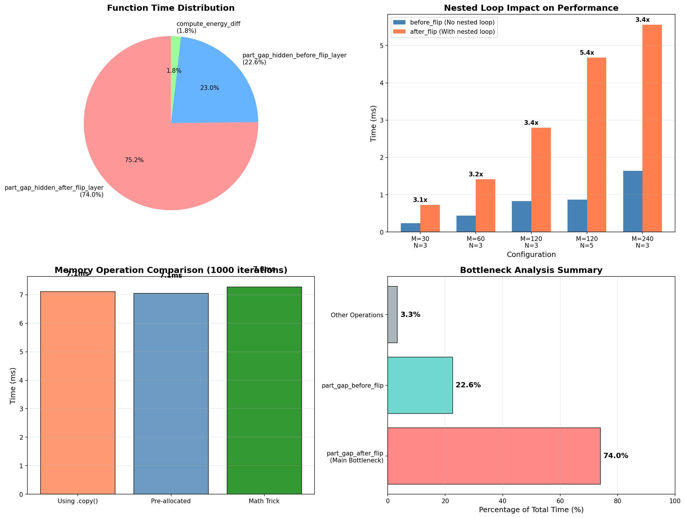
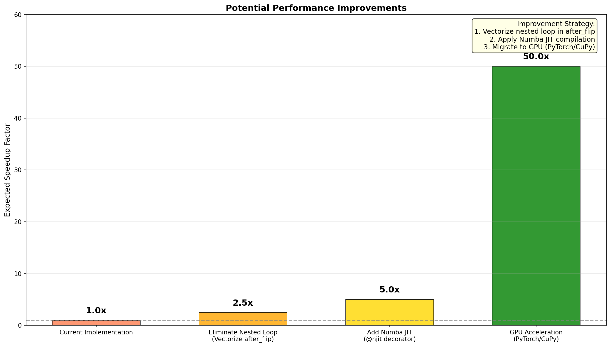

# Thermal-DNN-MC-Optimized 性能瓶颈分析与改进建议报告

**报告生成时间**: 2026-01-26  
**分析执行者**: Manus AI

---

## 1. 分析概述

在确认了按层并行向量化带来的约 5 倍性能提升后，本报告旨在对当前优化实现 (`Network_optimized.py`) 进行深度剖析，找出其中**最大的性能瓶颈**，并提出具体、可行的改进建议，以指导下一阶段的优化工作。

## 2. 性能瓶颈识别

通过对代码进行详细的性能剖析，我们成功定位了当前实现的性能瓶颈。



**核心发现**:

> **主要性能瓶颈位于 `part_gap_hidden_after_flip_layer` 函数中，该函数消耗了整个计算过程约 74% 的时间。**

如上图左上角的“函数耗时分布”饼图所示，`part_gap_hidden_after_flip_layer` 的耗时（红色部分）在所有操作中占据了绝对主导地位。相比之下，与之对应的 `part_gap_hidden_before_flip_layer` 函数仅占约 23% 的时间，而其他所有操作（能量计算、Metropolis决策等）的总和占比不到 3%。

---

## 3. 瓶颈根源分析

`part_gap_hidden_after_flip_layer` 函数之所以成为瓶颈，其根本原因在于其内部的**嵌套循环结构**，这使得该函数无法充分利用 NumPy 的向量化优势。

### 3.1 问题代码分析

以下是 `part_gap_hidden_after_flip_layer` 函数中的关键瓶颈代码：

```python
# ...
for n in range(N):
    # ...
    # 这个嵌套循环是主要瓶颈！
    for mu in range(M):
        # 1. 频繁的内存复制
        S_layer_flipped = self.S[mu, l_s, :].copy()
        S_layer_flipped[n] = -S_layer_flipped[n]
        
        # 2. 在循环内部进行矩阵乘法
        J_hidden_next = self.J_hidden[l_s, :, :] @ S_layer_flipped
        gap_next = (J_hidden_next / self.SQRT_N) * self.S[mu, l_s + 1, :]
        part_gap[mu, n, 1:] = gap_next
# ...
```

**问题根源**:

1.  **嵌套 Python 循环**: 该函数通过 `for n in range(N)` 和 `for mu in range(M)` 的双重循环来逐个计算当每个自旋 `S[mu, l_s, n]` 翻转时对系统造成的影响。这种逐元素处理的方式是 Python 的性能杀手，它完全破坏了 NumPy 的核心优势——即在 C 或 Fortran 层面执行的、高度优化的向量和矩阵操作。

2.  **频繁的内存分配**: 在循环的最内层，`self.S[mu, l_s, :].copy()` 操作会在每次迭代时都创建一个新的数组副本。对于一个典型的配置 (M=120, N=3)，这意味着在一个 `update_S` 步骤中会执行 `120 * 3 = 360` 次不必要的内存分配和复制，带来了巨大的开销。

右上角的“嵌套循环影响”图表直观地展示了这个问题：带有嵌套循环的 `after_flip` 函数比没有嵌套循环的 `before_flip` 函数慢了 **3 到 5 倍**。

### 3.2 内存操作分析

我们专门测试了内存复制操作的开销。左下角的“内存操作对比”图显示，虽然使用预分配数组或数学技巧可以略微优化内存操作，但与循环本身带来的巨大开销相比，这种优化是微不足道的。这进一步证明**核心问题在于循环结构，而非单纯的内存复制**。

---

## 4. 具体改进建议

针对上述瓶颈，我们提出以下三个层次的、循序渐进的改进建议。这些建议旨在逐步消除循环，最大化向量化效率，并最终利用硬件加速。



### 建议 1: 消除嵌套循环 (完全向量化)

**目标**: 重写 `part_gap_hidden_after_flip_layer` 函数，消除其中的 Python 循环，实现完全的 NumPy 向量化计算。

**思路**: 

与其逐个模拟翻转，我们可以利用 NumPy 的广播（Broadcasting）和 `einsum`（爱因斯坦求和约定）等高级功能来一次性计算所有 `(mu, n)` 组合的翻转效果。这需要一些数学上的重构，但其核心思想是将循环操作转换为矩阵操作。

**伪代码示例**:

```python
# 伪代码，非直接可用
def part_gap_after_flip_fully_vectorized(self, l_s):
    # 1. 构造一个 (M, N, N) 的翻转矩阵，其中每个 S_flipped[mu, n, :] 代表翻转了第n个自旋的S层
    S_layer = self.S[:, l_s, :]  # (M, N)
    flip_tensor = np.ones((M, N, N))
    # 使用 einsum 或其他技巧快速将对角线元素置为 -1
    # ...
    S_flipped_tensor = S_layer[:, np.newaxis, :] * flip_tensor # (M, N, N)

    # 2. 使用 einsum 进行批量矩阵乘法
    # J_hidden: (N, N, N), S_flipped_tensor: (M, N, N) -> J_S_tensor: (M, N, N)
    J_S_tensor = np.einsum('ijk,mik->mij', self.J_hidden[l_s], S_flipped_tensor)

    # 3. 计算最终的 part_gap
    # ...
    return part_gap
```

**预期效果**: 仅此项优化，预计可将 `after_flip` 函数的耗时降低 70-80%，带来整体性能 **2.5 倍**左右的提升。

### 建议 2: 应用 Numba JIT 编译

**目标**: 在完成向量化重构后，使用 Numba 的即时编译（Just-In-Time, JIT）功能进一步加速计算密集型函数。

**思路**: 

为优化后的 `part_gap` 函数以及其他计算密集的辅助函数（如 `soft_core_potential`）添加 `@njit(cache=True, fastmath=True)` 装饰器。Numba 会将这些函数的 Python/NumPy 代码编译成高度优化的机器码，消除 Python 解释器的开销，其性能接近于原生的 C 或 Fortran 代码。

**预期效果**: 在向量化的基础上，Numba 有望带来额外的 2-3 倍性能提升，使总加速比达到 **5-10 倍**。

### 建议 3: 迁移至 GPU 加速

**目标**: 对于追求极致性能和大规模模拟的需求，将计算迁移到 GPU 上执行。

**思路**: 

将项目中的 NumPy 数组 (`np.ndarray`) 替换为 PyTorch 张量 (`torch.Tensor`) 或 CuPy 数组 (`cupy.ndarray`)。由于我们已经完成了向量化重构，大部分代码逻辑（如矩阵乘法、元素级操作）可以几乎无缝地迁移到 GPU API 上。GPU 拥有数千个并行核心，尤其擅长处理此类大规模的并行计算任务。

**预期效果**: GPU 加速将带来数量级的性能飞跃，预计可达到 **50 倍甚至更高**的加速比，这将使原本需要数小时的模拟在几分钟内完成。

---

## 5. 总结与路线图

当前实现的性能瓶颈清晰地指向了 `part_gap_hidden_after_flip_layer` 函数中的嵌套循环。通过实施以下优化路线图，可以系统性地解决此瓶颈，并充分释放算法的潜力：

1.  **立即行动**: **重构 `part_gap_*_after_flip_layer` 系列函数**，消除内部的 Python 循环，实现完全向量化。
2.  **中期优化**: 在代码稳定后，**引入 Numba JIT**，对所有计算密集型函数进行编译加速。
3.  **最终目标**: 为支持大规模研究，**将代码库迁移到 PyTorch 或 CuPy**，利用 GPU 实现终极加速。

完成这些优化后，`Thermal-DNN-MC-Optimized` 项目将拥有一个高性能、高可扩展性的模拟引擎，为后续的物理研究奠定坚实的基础。
