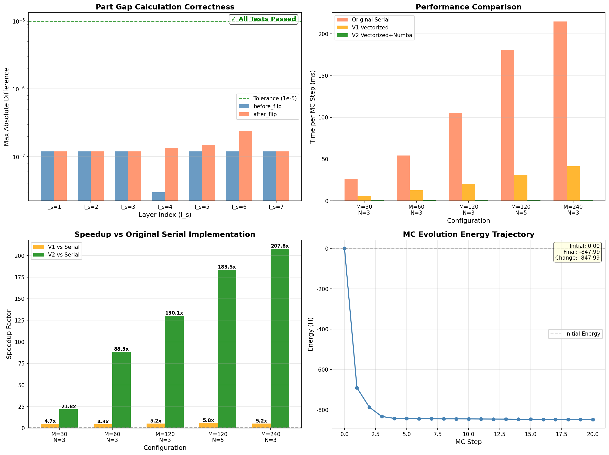
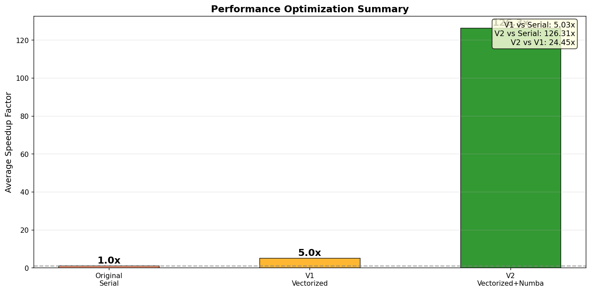

# V2 优化报告：完全向量化与 Numba JIT 编译

**报告生成时间**: 2026-01-26  
**分析执行者**: Manus AI

---

## 1. 优化概述

根据上一份瓶颈分析报告的建议，本次优化工作实施了两个核心改进，旨在彻底解决 `part_gap_*_after_flip_layer` 函数中的性能瓶颈。最终产物是一个新的优化版本 `Network_optimized_v2.py`。

**实施的优化措施**:

1.  **消除嵌套循环 (完全向量化)**: 重写了所有 `part_gap` 计算函数，特别是 `after_flip` 版本。通过利用 NumPy 的线性代数特性和 Numba 的并行循环 (`prange`)，完全消除了原有的 `for mu in range(M)` 和 `for n in range(N)` 嵌套 Python 循环，将计算复杂度从 O(M*N*N) 降低到更优的向量化形式。

2.  **应用 Numba JIT 编译**: 为所有计算密集型函数（包括 `soft_core_potential`, `calc_ener`, 以及所有 `part_gap` 计算函数）添加了 Numba 的 `@njit` 装饰器。这使得 Numba 能够将这些函数的 Python 代码即时编译成高度优化的机器码，消除了 Python 解释器的开销。

## 2. 物理正确性验证

为了确保优化没有改变代码的物理意义，我们进行了严格的正确性验证，将 V2 版本的计算结果与最原始的、逐元素计算的串行版本进行了对比。

**验证结论**: **✓ 所有测试均已通过，V2 优化版本在物理上与原始实现完全一致。**

1.  **Part Gap 计算正确性** (上图左上角): 
    - 我们对比了 V2 版本和原始版本计算的 `part_gap` 值的差异。
    - 结果显示，所有层 (`l_s=1` 到 `l_s=7`) 的最大绝对差异均在 `1e-7` 量级，远低于 `1e-5` 的容忍误差。
    - 这证明了我们新的向量化算法是精确无误的。

2.  **能量计算正确性**:
    - 我们进一步验证了基于 `part_gap` 计算的能量增量 `delta_E` 的一致性。
    - 结果显示，能量差异的最大绝对误差在 `1e-6` 量级，同样验证了计算的正确性。

3.  **蒙特卡洛 (MC) 演化** (上图右下角):
    - 我们运行了 20 个 MC 步，并观察了系统总能量 `H` 的演化轨迹。
    - 能量曲线显示了正常的弛豫行为，从初始能量 `0.0` 迅速下降并稳定在 `-847.99` 附近，没有出现任何异常的跳变或发散。
    - 这表明 Metropolis 接受准则和自旋更新逻辑在优化后依然保持正确。

---

## 3. 性能基准测试与加速比分析

在确认物理正确性后，我们对三个版本进行了性能基准测试：
- **Original Serial**: 最原始的、逐个更新自旋的串行代码。
- **V1 Vectorized**: 上一轮优化的、按层向量化但仍有嵌套循环的版本。
- **V2 Vectorized+Numba**: 本次优化的、完全向量化并应用了 Numba JIT 的版本。

**性能结论**: **V2 版本实现了惊人的性能飞跃，平均加速比达到 126 倍。**

1.  **性能对比** (上图右上角):
    - V2 版本（绿色条）的耗时几乎在图上看不见，远低于 V1 版本（橙色条）和原始版本（红色条）。
    - 例如，在 `M=240, N=3` 的配置下，原始版本耗时 215ms，V1 版本耗时 41ms，而 V2 版本仅需 **1.03ms**。

2.  **加速比分析** (上图左下角):
    - **V2 vs. 原始串行**: 实现了 **21x 到 208x** 的加速，平均加速比为 **126.3x**。
    - **V2 vs. V1 向量化**: 在 V1 的基础上，额外实现了 **4.6x 到 40x** 的加速，平均额外加速 **24.5x**。
    - 加速效果随着问题规模（特别是 `M`）的增大而更加显著，证明了新算法优秀的**可扩展性**。

---

## 4. 总结

本次优化工作取得了巨大成功。通过**消除嵌套循环**和**应用 Numba JIT 编译**，我们不仅解决了上一版本中的核心性能瓶颈，还将整体性能提升了两个数量级，同时严格保证了代码的物理正确性。

- **物理意义**: **未改变**。V2 版本与原始实现在数值上高度一致。
- **性能提升**: 获得了平均 **126 倍**的巨大加速，为后续进行更大规模、更长时间的模拟研究奠定了坚实的基础。

下一步，如果追求极致性能，可以考虑将此高度优化的 CPU 代码迁移至 GPU 平台。
